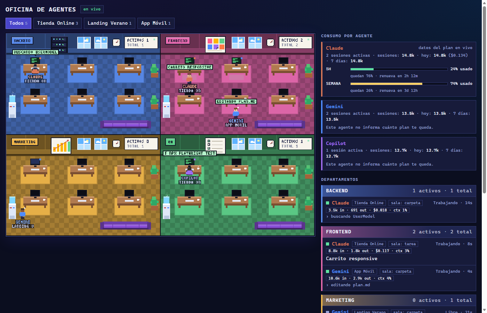
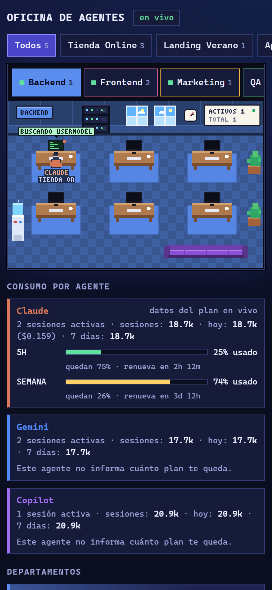

# Oficina de Agentes

Una oficina en **pixel-art** que muestra en vivo qué están haciendo tus agentes de IA (Claude Code, GitHub Copilot CLI,
Gemini CLI u otros): en qué departamento trabajan, en qué proyecto, con qué tarea, cuántos tokens han gastado y cuánto
plan te queda. Funciona en tu PC, se ve en el navegador y también en el celular (como app instalable o como `.apk`).



> Es un proyecto independiente y **no está afiliado** a Anthropic, GitHub, Microsoft ni Google. Claude, Copilot y Gemini
> son marcas de sus respectivos dueños.

## Qué hace

- **Cuatro salas** (Backend, Frontend, Marketing, QA; configurables). Cada agente es un personajito que camina a su
  escritorio cuando trabaja, levanta la mano si necesita tu atención, se pone gris si se queda sin tokens, celebra al
  terminar y descansa en el sofá cuando está libre.
- **Sala por tarea:** el agente se mueve de sala según lo que le pides ("haz un portafolio" → Frontend, "agrega tests" → QA),
  o por la carpeta donde trabaja.
- **Consumo:** tokens por sesión / hoy / 7 días y, cuando el agente lo informa, tu uso del plan (p. ej. ventanas de 5 h y
  semanal de Claude Code, solicitudes premium de Copilot) con la hora de renovación.
- **Multi-proyecto:** filtra por proyecto; cada sesión aparece sola.
- **Celular:** interfaz responsive (una sala a la vez), app instalable (PWA) y una app nativa de Android.

## Privacidad: cada quien usa lo suyo

Este repositorio **no contiene sesiones ni datos de nadie**. Es una herramienta *self-hosted*: cada persona ejecuta su propio
servidor y las sesiones que ve son las de **sus** agentes.

- Todo es local: sin nube, sin cuentas, sin telemetría.
- El servidor escucha solo en `127.0.0.1` y toda la API exige un **token aleatorio** que se genera en tu PC
  (`data/token.txt`). Trátalo como una contraseña: quien tenga la URL con el token puede ver lo que hacen tus agentes
  (extractos de tus peticiones y de los comandos que ejecutan).
- `data/` (token e historial SQLite), `config.json` (tu configuración) y `android/keystore/` (tu llave de firma) están en el
  `.gitignore` y nunca se suben.

## Inicio rápido

Requisitos: **Node.js ≥ 22.13** (desarrollado y probado en Windows 11 con Node 24).

```bash
git clone https://github.com/josearpa123/Oficina_agentes.git
cd Oficina_agentes
npm install            # solo instala "qrcode", usado por `npm run phone`
npm start              # imprime la URL con tu token → ábrela en el navegador
npm run demo           # (otra terminal) simula agentes para ver la oficina en acción
```

Sin cambiar nada usa `config.example.json`. Para personalizar (salas, proyectos, presupuestos…):
`cp config.example.json config.json` y edítalo — `config.json` es tuyo y no se sube a git.

## Conectar tus agentes

| Agente | Cómo | Qué se ve |
|---|---|---|
| **Claude Code** | `npm run install-claude-hooks` | tareas, cada herramienta en vivo, esperas de permiso |
| Claude Code (consumo) | `npm run install-claude-statusline` | tokens y % de tu plan (Pro/Max) con hora de renovación |
| **Copilot CLI** | automático (Windows) | tarea, herramientas, preguntas pendientes, errores de cuota, tokens al cerrar, solicitudes premium |
| **Gemini CLI / otros** | `node connectors/run-agent.js --agent gemini -- gemini -p "…"` | inicio/fin, última línea de salida, detección de límites |
| **Cualquier cosa** | `POST /api/event` | lo que tú envíes |

- **Claude Code:** el instalador edita `~/.claude/settings.json` (deja copia en `settings.json.bak-agent-office`, no toca tus
  otros hooks). Quitar todo: `npm run uninstall-claude-hooks`. Los hooks nunca bloquean ni fallan Claude Code: si el servidor
  está apagado simplemente no pasa nada. Reinicia las sesiones abiertas para que los carguen.
- **Copilot CLI:** el servidor incluye un vigilante que detecta cada `copilot.exe` y **lee, solo en lectura**, los archivos que
  Copilot deja en `~/.copilot` (`logs/` y `session-state/<id>/events.jsonl`). Desactivar:
  `"watchers": { "copilot": false }` en `config.json`. Solo Windows por ahora.
- **Gemini CLI:** Google dejó de admitir el login con cuenta personal en Gemini CLI; hoy funciona con `GEMINI_API_KEY`.
  El wrapper también sirve con cualquier otro CLI (`--scan` lee la salida en modo `-p`).
- **API genérica:**
  ```
  POST /api/event        cabecera x-token: <token>
  { "agent": "mi-agente", "session": "abc", "cwd": "/ruta/proyecto", "type": "task", "text": "Maquetar hero" }
  ```
  `type`: `session_start` · `task` · `action` · `idle` · `notify` · `limit` · `usage` · `session_end`.
  Un evento `usage` lleva `usage: {tokensIn, tokensOut, costUsd}` (acumulados por sesión) y opcionalmente
  `limits: [{id, label, usedPct, resetsAt(ms)}]`.

## Configuración (`config.json`)

| Clave | Para qué |
|---|---|
| `departments` | las salas (id, nombre, color); cada sala dibuja hasta 6 agentes con escritorio |
| `agents` | nombre, color y sala por defecto de cada agente |
| `routes` | expresiones regulares sobre la **carpeta** de trabajo → sala |
| `taskRoutes` | expresiones regulares sobre el **texto de la tarea** → sala (gana la sala con más coincidencias; el mensaje más reciente pesa más) |
| `projects` | `{ "name": "Mi tienda", "path": "/ruta/a/mi-tienda" }` para poner nombre a tus carpetas |
| `budgets` | `{ "gemini": { "tokensPerDay": 1000000 } }` barra **estimada** para agentes que no informan su cuota |
| `watchers` | `{ "copilot": false }` para apagar el vigilante |
| `port`, `host` | por defecto `4317` y `127.0.0.1` |

Prioridad de sala: explícita (`AGENT_DEPT`) → texto de la tarea → carpeta → sala por defecto del agente.
Cada agente muestra un chip `sala: tarea | carpeta | defecto` para que veas por qué está donde está.
Otras variables: `AGENT_OFFICE_TOKEN`, `AGENT_OFFICE_DATA`, `AGENT_OFFICE_CONFIG`, `PORT`, `HOST`.

## En el celular



```bash
npm run phone               # revisa Tailscale y te dice qué falta; imprime la URL + QR
npm run phone -- --setup    # publica la oficina en tu red privada de Tailscale
npm run phone -- --lan      # alternativa solo Wi-Fi de casa (sin cifrar; ver advertencias)
```
- **Tailscale (recomendado):** el servidor sigue escuchando solo en `127.0.0.1`; Tailscale lo expone por HTTPS solo a tus
  dispositivos. Con HTTPS el navegador permite "Instalar app".
- **App Android (`.apk`):** `npm run android:build` (necesita Android Studio/SDK y JDK 17; no usa Gradle) genera
  `android/build/oficina.apk`; `npm run android:install` la instala por USB. La primera vez pide el enlace de tu oficina y
  luego lo recuerda. La llave de firma se crea en `android/keystore/` — guárdala si quieres poder actualizar la app.
  Sin teléfono por USB, copia el `.apk` al teléfono y ábrelo.

## Estructura

```
server/     API HTTP + SSE, estado de los agentes, historial SQLite, vigilante de Copilot
web/        la oficina (canvas procedural) y los paneles; PWA (manifest + service worker)
hooks/      hook y línea de estado de Claude Code
connectors/ wrapper genérico para CLIs
scripts/    instalador de hooks, demo, asistente de celular, generador de íconos
android/    app nativa (WebView) y su script de compilación
lib/        cliente compartido y carga de configuración
```

## Límites conocidos

- Probado en Windows 11 + Node 24. El servidor, los hooks y la interfaz deberían funcionar en macOS/Linux, pero no se
  probó; el vigilante de Copilot solo existe para Windows.
- La app Android se probó en un emulador, no en un teléfono físico.
- Ningún agente expone tu "plan restante" de forma uniforme: Claude Code (Pro/Max) y Copilot lo informan, Gemini no.
- Solo **monitorea**: aún no se pueden dar órdenes a los agentes desde la oficina.

## Licencia

Pendiente de elegir por quien publica el repositorio (ver `LICENSE`).
